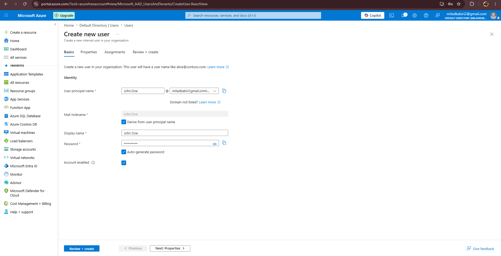
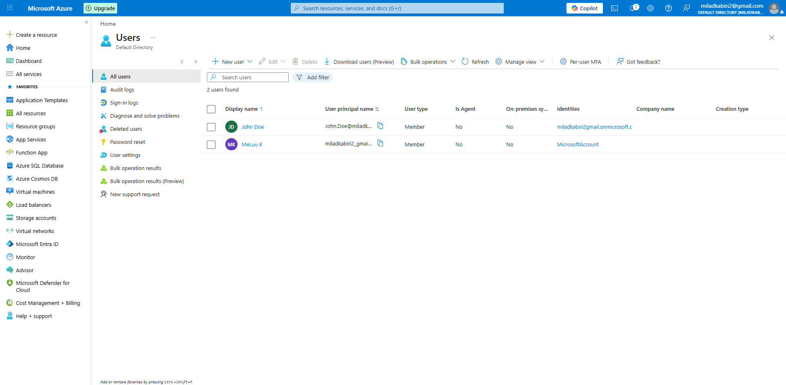
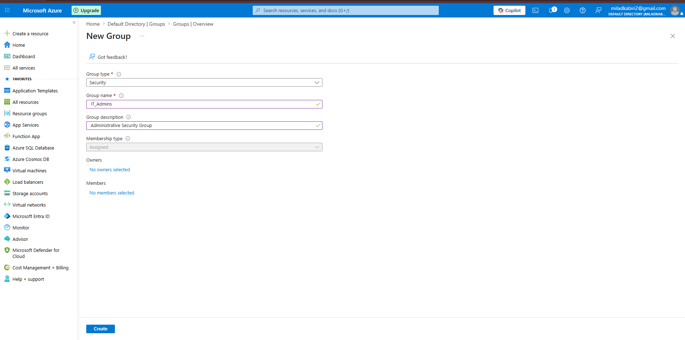
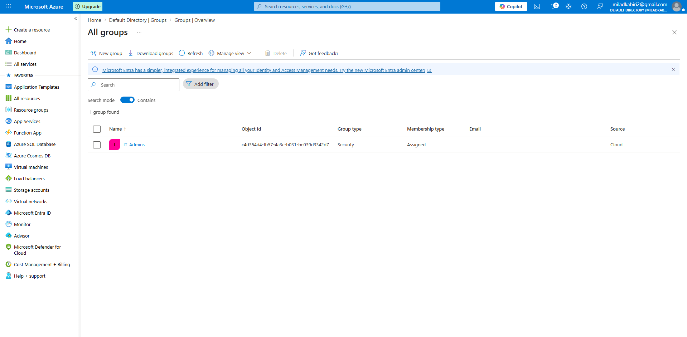
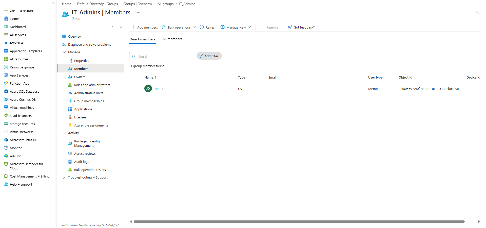
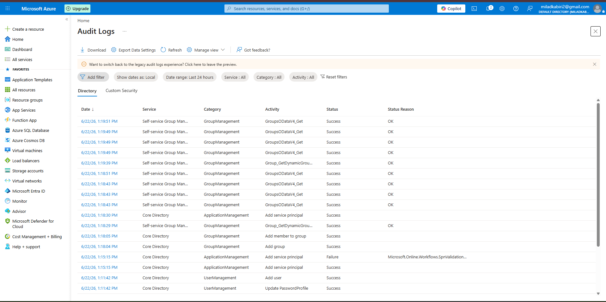

# Azure Entra ID Security Lab

## Overview

This project demonstrates Identity and Access Management (IAM) operations using Microsoft Entra ID (Azure AD). Activities include user provisioning, security group management, membership assignment, and audit log monitoring.

---

## User Creation

### Objective

Create a cloud user account in Microsoft Entra ID.

### Screenshots

### Skills Demonstrated

- User Administration
- Identity and Access Management (IAM)
- Microsoft Entra ID
- Cloud Identity Management

---

## Security Group Creation

### Objective

Create a security group and assign users to demonstrate role-based access control (RBAC).

### Screenshots

### Skills Demonstrated

- Group Administration
- RBAC
- Identity and Access Management
- Access Control
- Microsoft Entra ID

---

## Audit Log Monitoring

### Objective

Review Microsoft Entra ID audit logs to verify administrative actions.

### Screenshot

### Skills Demonstrated

- Audit Log Analysis
- Security Monitoring
- IAM Monitoring
- Administrative Activity Tracking
